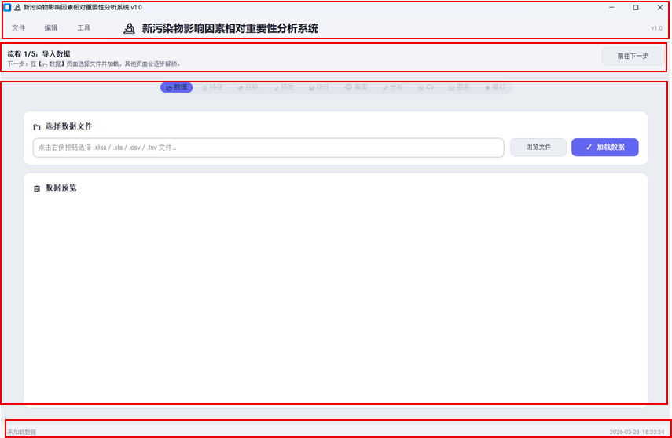
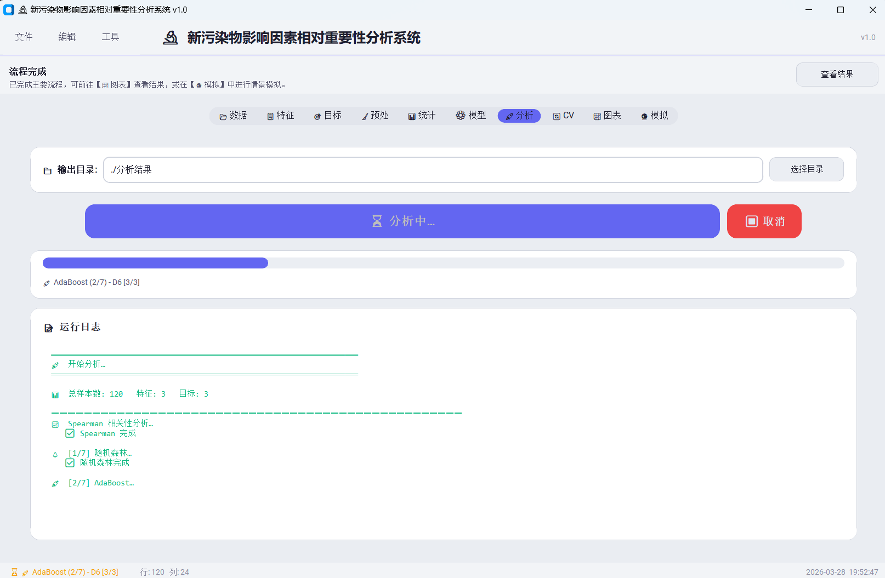
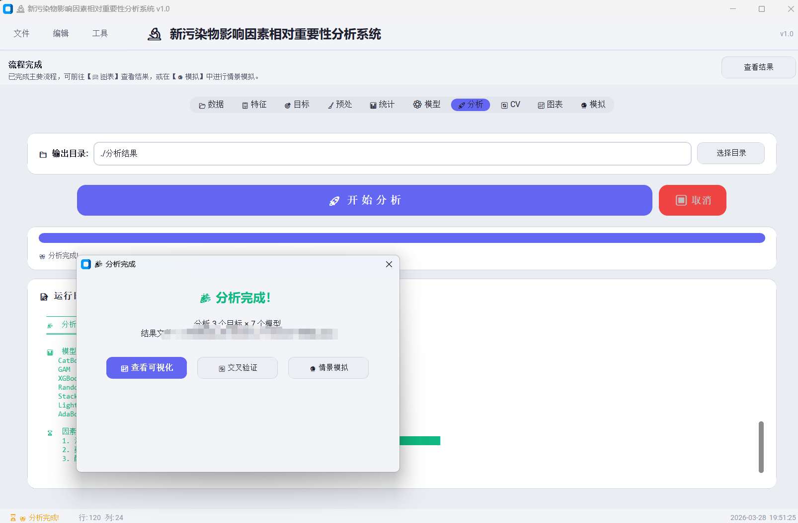

# 新污染物影响因素相对重要性分析系统

摘要：本系统面向新污染物环境数据分析任务，构建多模型机器学习框架以定量表征影响因素对目标污染物浓度的相对重要性（RI），并通过可解释性分析与交叉验证提升结果的稳健性与可复现性。

本项目是一个面向新污染物研究的桌面分析系统，核心目标是通过机器学习评估影响因素的相对重要性（Relative Importance, RI），辅助科研人员进行变量筛选、机制讨论与结果解释。系统覆盖数据导入、预处理、建模、交叉验证、可视化与报告导出全流程，强调结果可复现与过程可追溯。

一句话定位：以 RI 评估为核心的零代码图形化机器学习分析平台。

## 当前验证状态

- 已完成：代码语法编译检查（compileall）
- 已完成：关键算法口径一致性修正（PI、CatBoost 分类特征、Spearman 分类处理）
- 已完成：UI 关键流程修复（数据加载后预处理页状态同步）
- 待补充：完整业务回归记录（导入 -> 预处理 -> 分析 -> 图表 -> 模拟 -> 导出）

## 结果解释边界

- 统计相关性与模型重要性不等于因果关系，结论需结合机理与实验验证。
- 小样本或高噪声数据会放大不确定性，建议报告中同时呈现稳定性与置信信息。
- 结果质量高度依赖数据质量与特征工程，异常值、缺失值和编码策略会显著影响 RI 排序。

## 核心目标

- 使用多模型方法评估“哪些因素更重要、重要到什么程度”
- 输出可直接用于科研与汇报的 RI 排序、模型性能和解释图表
- 降低机器学习分析门槛，实现零代码图形化操作

## 项目定位

- 面向环境科研与管理场景
- 零代码图形化分析流程
- 多模型对比与可解释性优先

## 核心功能

- 数据导入：Excel/CSV/TSV
- 特征与目标选择：支持搜索、排序与类型配置
- 预处理：缺失值、异常值、变换、降维、筛选
- 分析：RF/AdaBoost/XGBoost/LightGBM/CatBoost/GAM/Stacking（以因素相对重要性 RI 评估为核心）
- 验证：K 折交叉验证
- 图表：热力图、重要性、性能对比、SHAP、学习曲线
- 模拟：What-If 实时推演
- 导出：结果、配置、日志、报告

## 项目截图

### 主界面



### 分析进行中页面



### 分析完成结果页面



## 快速开始

### 1) 安装依赖

```bash
pip install -r requirements.txt
```

### 2) 本地运行

```bash
python run.py
```

### 3) 打包

在项目根目录执行以下命令进行 PyInstaller 打包：

```bash
pyinstaller --clean --noconfirm --onedir --noconsole \
	--name "新污染物分析系统" \
	--icon "icon.ico" \
	--collect-submodules modules \
	--collect-all customtkinter \
	--collect-all matplotlib \
	--collect-all numpy \
	--collect-all pandas \
	--collect-all scipy \
	--collect-all sklearn \
	--collect-all openpyxl \
	--collect-all shap \
	--collect-all xgboost \
	--collect-all lightgbm \
	--collect-all catboost \
	--collect-all platformdirs \
	--collect-all chardet \
	--collect-all statsmodels \
	--collect-all pygam \
	--hidden-import tkinter \
	--hidden-import tkinter.ttk \
	--exclude-module matplotlib.tests \
	--exclude-module numpy.tests \
	--exclude-module numpy.f2py.tests \
	--exclude-module pandas.tests \
	--exclude-module scipy.tests \
	--exclude-module sklearn.tests \
	--exclude-module pytest \
	launcher.py
```

Windows PowerShell 可将续行符 `\` 改为反引号 `` ` `` 使用。

## 文档导航

- 完整系统说明书: [docs/system-manual.md](docs/system-manual.md)
- 贡献指南: [CONTRIBUTING.md](CONTRIBUTING.md)
- 开源许可: [LICENSE](LICENSE)

## 常见问题（简版）

### 为什么不同版本结果不一致？

通常来自预处理、编码、参数和重要性口径差异。建议固定数据、参数与随机种子后比较。

### 打包时出现 tests/pytest/torch 相关 warning 有影响吗？

多数属于可选或测试模块扫描提示，常规桌面分析流程通常不受影响。

## 免责声明

本项目仅用于科研、教学与数据分析参考，不构成监管结论、工程验收结论或医疗/安全决策依据。

使用者需自行保证数据质量、参数合理性和结果解释正确性。作者与贡献者不对因使用本项目造成的直接或间接损失承担责任。

补充说明：

- 本项目输出结果受输入数据质量、样本规模、特征工程策略、参数设置和随机过程影响，结果可能存在偏差或不确定性。
- 本项目不保证在任何特定场景下的准确性、完整性、适用性或持续可用性。
- 禁止将本项目结果作为唯一依据直接用于高风险场景决策（包括但不限于应急处置、公共安全、执法处罚、医疗诊断等）。
- 使用者应结合领域知识、独立验证和必要的专家复核后再进行业务应用。
- 若使用者导入了包含个人信息、敏感信息或受监管数据，数据脱敏、授权、存储与传输合规责任由使用者承担。
- 本项目依赖第三方开源库，其行为与许可证约束由对应项目负责；使用者应自行核查并遵守相关许可证条款。
